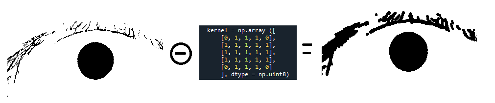

# Info 
This project is to learn the basics of image processing, as the use of ready-made libraries is prohibited

Must be installed

pip install opencv-contrib-python 

pip list

in consol unchack

compile python to exe

pip install pyinstaller

pyinstaller --onefile pythonScriptName.py

gui.py ghrafical user interface

functions.py basic functions

Test_AotoSegmentation.py Segmentation all image in Casia_xxx_1_x => Casia_Segmentation

République Algérienne Démocratique et Populaire

Ministère de l\'Enseignement Supérieur et de la Recherche Scientifique

Université Ben YOUCEF BENKHEDDA-Alger1

{width="1.21875in"
height="1.303238188976378in"}

Faculté des Sciences

Département des Mathématiques et Informatique

Option : Ingénierie des Systèmes d'Informatique intelligent

Mini projet de TP du module Traitement d\'image numérique.

Thème

  -----------------------------------------------------------------------
  Réalisation d'un système biométrique d'identification d'individus par
  l'iris.

  -----------------------------------------------------------------------

**Réalisé par :**

\- LOUNIS Amar G03.

\- BOUCHELALEG Houria G03.

-KOURI Ferial G03.

2020/2021

**Introduction:**

Face à la fraude documentaire et au vol d\'identité, aux menaces du
terrorisme ou  de la cybercriminalité, et face à l\'évolution logique
des réglementations internationales, de nouvelles solutions
technologiques sont progressiv​ement mises en œuvre.

Parmi ces technologies, la biométrie s\'est rapidement distinguée comme
la plus pertinente pour identifier et authentifier les personnes de
manière fiable et rapide, en fonction de caractéristiques biologiques
uniques, comme l'identification d'individu par l'iris. C\'est l\'une des
technologies récentes. En effet, cet organe coloré de l'œil est situé
entre la sclère (blanc de l'œil) et la pupille. L'iris offre une grande
richesse d'informations qui sont propres à chaque individu, et qui
restent stables tout au long de la vie d'une personne. La biométrie par
l'iris a la réputation d'être parmi les modalités biométriques les plus
sûres.

Un système biométrique d'identification d'individus comporte toujours
deux phases de fonctionnement:

1- La phase d'enrôlement (phase off-line).

2-La phase de reconnaissance (phase on-line).

La figure suivante montre l\'architecture des deux phases de ce système
avec ces différents modules:

{width="6.5in"
height="2.3696237970253717in"}

**Figure 1.** Architecture d'un système de reconnaissance biométrique.

Le but de ce mini-projet est de développer un système biométrique
d'identification d'individus par l'iris permettant, à travers une
interface graphique, d'introduire une image d'iris et d'afficher, après
les étapes de traitement, l'identité de la personne identifiée dans la
base de données. Cette dernière comprend 756 images infrarouges issues
de 108 yeux de 80 sujets.

Pour réaliser ce travail nous avons créé une interface graphique permet
d\'introduire une image requête, faire les traitements nécessaire sur
cette image et à la fin afficher le résultat obtenu.

La figure suivante montre notre interface graphique:

{width="6.5in"
height="3.550640857392826in"}

**Figure 2.** Représentation de l\'interface graphique.

Telle que les numéros mentionnés montrent:

**1-** sélectionner une image.

**2-** zone d\'affichage du lien de l\'image sélectionnée, et nous
pouvons aussi coller le lien d\'une image directement.

**3-** champ d\'affichage de l\'image sélectionnée.

**4-** zone d\'affichage des résultats obtenus après les traitements
fait sur l\'mage.

**5- histogramme** : décrit la répartition des niveaux de gris de
l'image introduite.

L'histogramme de cette image montre combien de fois chaque niveau de
gris apparait dans l'image.

Définition mathématique : h(i) = card {(u , v) \| I (u , v) = i} avec
h(i) = nombre des pixels ayant l\'intensité i où 0 ≤ i ≤ k tel que k est
le nombre maximal d\'intensité de l\'image comme montre l\'affichage
suivant:

{width="6.5in"
height="2.473611111111111in"}

**Figure 3.** Affichage d\'histogramme.

**Lissage des images:**

Nous passons maintenant au traitement de lissage d\'images, nous allons
appliquer plusieurs types de filtres sur les images pour choisir le bon
filtre qui donne un bon résultat.

**6- smoothing**: C\'est un lissage en choisissant un filtre moyen
pondéré **3 x 3** où la somme totale des coefficients est égale à 1
comme suit:

(\[ \[0 , 1 / 9, 0 \],

\[1 / 9, 5 / 9, 1 / 9\],

\[0 , 1 / 9, 0 \] \])

{width="6.5in"
height="2.7895833333333333in"}

**Figure 4.** Résultat du filtre moyen pondéré.

**7- smoothing medium filter:** c\'est un lissage en appliquant un
filtre moyen

(\[ \[1 / 9, 1 / 9, 1 / 9\],

\[1 / 9, 1 / 9, 1 / 9\],

\[1 / 9, 1 / 9, 1 / 9\] \])

{width="5.563998250218723in"
height="2.418198818897638in"}

**Figure 5.** Résultat du filtre moyen.

**8- vertical outlines**: pour obtenir le contour vertical nous avons
appliqué un filtre avec des valeurs positives et négatives:

(\[ \[-1, 0, 1\],

\[-2, 0, 2\]

\[-1, 0, 1\] \])

{width="6.5in"
height="2.8209405074365703in"}

**Figure 6.** Résultat du contour vertical.

**9- horizontal outlines**: pour obtenir le contour vertical nous avons
appliqué un filtre avec des valeurs positives et négatives:

(\[ \[-1, -2, -1\],

\[0, 0, 0\],

\[1, 2, 1\] \])

{width="6.5in"
height="2.823134295713036in"}

**Figure 7.** Résultat du contour horizontal.

**Amélioration du contraste:**

Le contraste est une propriété intrinsèque de l'image qui quantifie la
différence de luminosité entre ses parties claires et sombres.

•Image à contraste élevé : Plage d'intensité large.

•Image à faible contraste : Plage d'intensité réduite.

Dans cette étape nous avons créé quatre fonctions différentes, la
première pour le contraste lmin = 50 lmax = 200, la deuxième pour le
contraste logarithmique, la troisième pour le contraste linéaire et la
dernière pour le contraste d\'inversement.

**10- contrast lmin=50 lmax=200:**

{width="6.038655949256343in"
height="2.536235783027122in"}

**Figure 8.** contrast lmin=50 lmax=200.

11- contrast log:

{width="6.106486220472441in"
height="2.6795625546806647in"}

**Figure 9.** Contraste logarithmique.

12- contrast linear:

{width="6.5in"
height="2.80505905511811in"}

**Figure 10.** Contraste linéaire.

13- contrast inverse:

{width="6.5in"
height="2.770331364829396in"}

**Figure 11.** Contraste inverse.

**14- segmentation**: la segmentation de d\'une image est la
décomposition de l\'image en un ensemble de régions connexes présentant
une homogénéité selon un critère de similarité. Son objectif est
d\'obtenir une représentation significative de nos images, et plus
exactement de pouvoir séparer l\'iris du pupille et de toutes les zones
autour de l\'iris (nous devons garder que l\'iris). Pour sauver ce
problème nous avons travailler avec l\'équation du cercle qui est:

**(X - j)^2^ + (Y - i)^2^ = r^2\ ^**

Pour connaitre tous ce qui est à l\'extérieur du cercle on pose: **(X -
j)^2^ + (Y - i)^2^\> r^2^,** donc nous traduisons cette formule sous un
code python en mettant toutes les pixels à l\'extérieur de l\'iris en
noire, et les pixels à l\'intérieur de l\'iris

**(X - j)^2^ + (Y - i)^2^\<r^2^**en noire aussi. L\'image en bas montre
le résultat obtenu:

{width="4.716461067366579in"
height="3.5833333333333335in"}

**Figure 16.** Matrice du pupille**.**

Les pixels noirs ici représentent le pupille obtenu après l\'application
du seuillage avec un seuil égal à 50.

Le code suivant montre comment déterminer le centre et le rayon du
pupille:

{width="4.614583333333333in"
height="2.9791666666666665in"}

Ensuite, tous les pixels à l\'extérieur de l\'iris doivent être en blanc
avec une densité égal à 255:

{width="3.84375in"
height="1.0729166666666667in"}

Tous les pixels internes de pupille doivent être noirs avec une densité
égale à
0{width="4.28125in"
height="1.0833333333333333in"}

{width="6.5in"
height="2.89878280839895in"}

**Figure 17.** Segmentation**.**

**15- thresholding:** c\'est le processus de binarisation, aussi appelé
seuillage représente une transformation ponctuelle de la forme:

*B \[i , j\] = g(A\[i , j\]), 0* ≤*i \< N, 0* ≤*j \< M*

*Avec g(l)= 0 si l \< seuil sinon g(l)= 01*

Où seuil est une valeur d\'intensité à déterminer.

Nous avons développé une méthode en python pour choisir la bonne valeur
de seuillage automatiquement à partir de l\'interface graphique, les
exemples suivants montrent les résultats obtenus après plusieurs essayes
des différentes valeurs où le meilleur seuil égale à 50.

-   **La morphologie:**

**16-** représente une barre de défilement qui permet de changer les
valeurs de seuillage.

Exemple 1: seuillage = 164.

{width="6.5in"
height="2.8097222222222222in"}

**Figure 12.** Seuillage = 164.

Exemple 2: seuillage = 128.

{width="6.5in"
height="2.798611111111111in"}

**Figure 13.** Seuillage = 128.

Exemple 2: seuillage = 89.

{width="6.5in"
height="2.77042760279965in"}

**Figure 14.** Seuillage = 89.

Exemple 2: seuillage = 50.

{width="6.5in"
height="2.7541174540682416in"}

**Figure 15.** Seuillage = 50.

Est rapidement devenue une théorie fondamentale du traitement et de
l\'analyse d\'images. Les opérateurs qu\'elle propose permettent de
fournir des outils pour toute la chaîne de traitement d\'images, des
prétraitements à l\'interprétation de scènes. Ils permettent de
transformer les images, d\'en extraire des caractéristiques, des objets
ou encore des mesures par une analyse associant propriétés des objets
eux-mêmes et propriétés du contexte.

Dans notre projet nous avons appliqué deux opérations major de la
morphologie qui sont:

**17- érosion**: l\'opération d\'érosion permet de supprimer des
extrusions, peut être utilisée pour réduire les formes.

Définition mathématique:

$$E(I,F) = I \circleddash F = \left\{ z\ |\ (F)_{z} \subseteq I \right\}$$

> {width="7.3125in"
> height="1.5208333333333333in"}

**18- dilatation** : ce bouton représente l\'opération de la dilatation
qu\'il s\'agit d\'un processus permet de réparer des traits interrompus,
cette opération permet aussi de combler les intrusions (ou trous) dans
un objet.

-   Définition mathématique

$$D(I,F) = \ I \oplus F = \left\{ z\ |\ \left( F^{*} \right)_{z} \cap I \neq \varnothing \right\}$$

{width="7.3125in"
height="1.625in"}

**19- save**: ce bouton permet d\'enregistrer sur nos ordinateurs tous
les résultats obtenus après faire les traitements voulus.

Après avoir déterminé les images que nous entrerons dans la BDD, le
descripteur de l\'image et son titre seront stockés dans la liste.

**20- Add iris to database** **ce bouton vous permet de sélectionner
l\'ensemble d\'images que vous souhaitez ajouter à la base de données**

**Remarque: c\'est mieux**

**Pour plus d\'efficacité, pour connaître l\'iris, veuillez effectuer
les opérations nécessaires, dont les plus importantes sont
segmentation**

{width="2.7916666666666665in"
height="1.5520833333333333in"}

**Figure 20**. L\'ajout dans la BDD.

21- **check database **: ce bouton permet d'afficher le nombre d'image
insérée dans la BDD.

{width="2.7916666666666665in"
height="1.5520833333333333in"}

> **Figure 21**:Check data base
>
> 22- **- Le bouton Recognition**: cette opération permet de détectés
> les points d'intérêts de l'image\
> d'entrée par faire une comparaison avec ceux enregistrés après la
> phase d'apprentissage (enrôlement). La mise en correspondance de deux
> points clés est obtenue en trouvant les points clés candidats qui vont
> être matchés en se basant sur la distance euclidienne. La décision
> d'acceptation ou de rejet d'une personne dépend du nombre de
> points-clés matchés entre le modèle en entrée et les modèles
> enregistrés dans la phase d'apprentissage. Un candidat peut ne pas
> être dans la base de données. Le système doit déterminer laquelle des
> identités correspondent au mieux à ce candidat.
>
> Plus le nombre de points matchés est grands plus la possibilité de
> trouver la personne recherché est forte.

{width="6.5in"
height="3.6050984251968505in"}

> **Figure 22**: Reconnaissance.

1- représente les points de Similitudes communs.

2-représente le titre de l\'image reconnue.

{width="6.5in"
height="3.784103237095363in"}

> **Figure 23**: Reconnaissance.
>
> Remarque importante: nous devons faire tous les traitements
> nécessaires sur les images avant de les ajouter à la BDD.
>
> L\'exemple suivant montre le résultat obtenu en cas d\'introduire une
> image qui n\'existe pas dans la base de données:
>
> {width="6.5in"
> height="3.937104111986002in"}
>
> **Figure 24**: Image non reconnue.

1- représente les points de Similitudes communs.

2-un message affiche que l\'image n\'existe pas dans la BDD.

3- le titre de l\'image la plus similaire.

**Conclusion :**

La biométrie est un domaine à la fois passionnant et complexe. Elle
tente, par des outils mathématiques souvent très évolués.

Pour implémenter notre application nous avons passé par deux phases:

**1-Enrôlement :** cette phase est dédiée à faire les prétraitements et
aussi pour extraire les caractéristiques.

**2-Reconnaissance** : cette phase permet de comparer les
caractéristiques extraites avec le modèle enregistré dans la base de
données du système. Notre système de reconnaissance est capable de
reconnaitre une personne à partir d\'autres personnes déjà entrées dans
la base de données, il existe des cas où l\'image de la personne
identifiée ne serait pas celle qu'on cherche, cela est peut être du au
choix des paramètres. C\'est pour cela nous cherchons à l\'avenir de
développer ce système de reconnaissance pour devenir plus efficaces.
